## {data-name="Intro" .no-heading}

::: {.landscape-grid}

::: {.landscape-project}

[ESB-vaktin]{.project-name}

[*EU referendum, fact-checked*]{.project-tagline}

:::

::: {.landscape-project}

[Þingfréttir]{.project-name}

[*Alþingi pundit, in English*]{.project-tagline}

:::

::: {.landscape-project}

[Metill.is]{.project-name}

[*Public-interest data platform*]{.project-tagline}

:::

::: {.landscape-project}

[Sirkabát]{.project-name}

[*Podcast with Georg Gylfason*]{.project-tagline}

:::

:::

## {data-name="Þingfréttir" .no-heading}

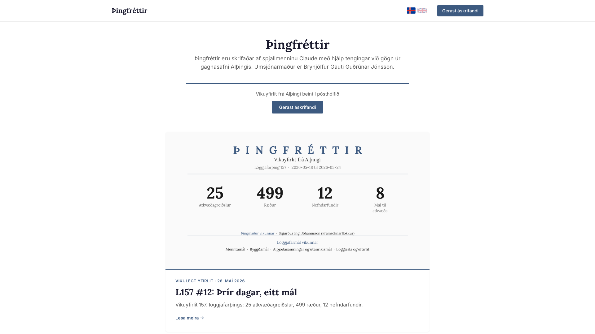{.site-frame fig-align="center" width="72%"}

## {.no-heading}

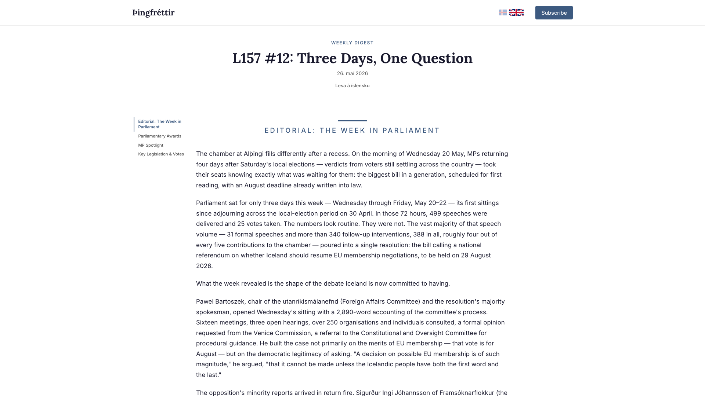{.site-frame fig-align="center" width="58%"}

## {.no-heading}

::: columns
::: {.column width="70%"}
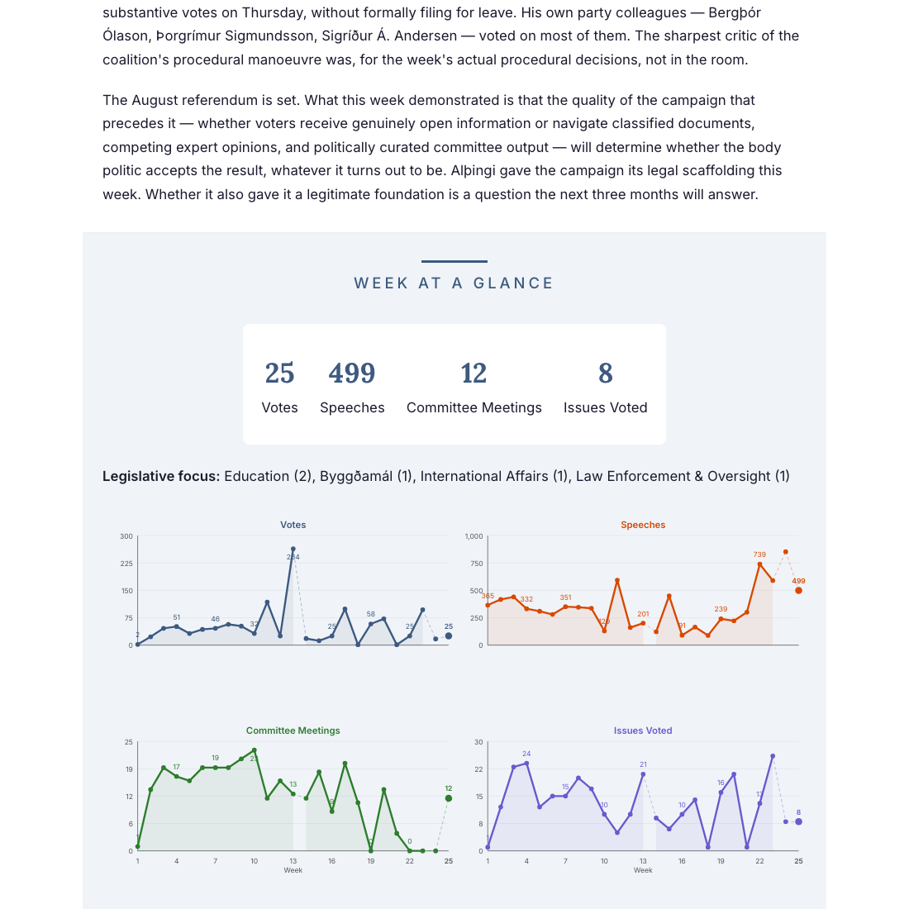{.site-frame fig-align="center" width="100%"}
:::
::: {.column width="30%"}

::: {.chart-callout .fragment}
[Icelandic review]{.label}

[Miðeind]{.name}
:::

:::
:::

## {.no-heading}

::: {.image-stack}
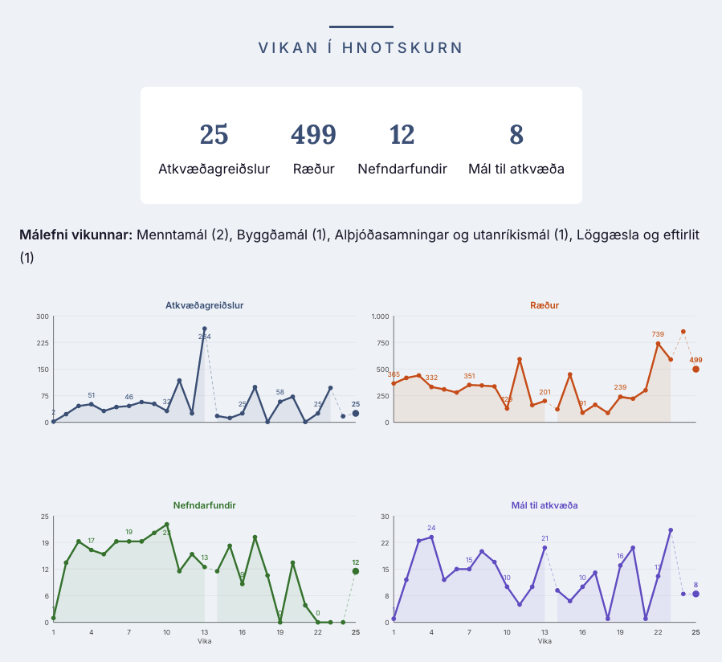{.stack-image .fragment}
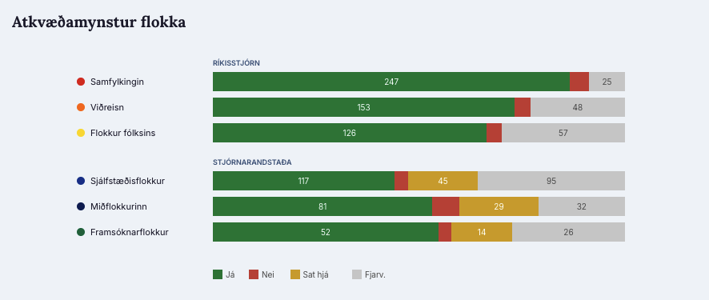{.stack-image .fragment}
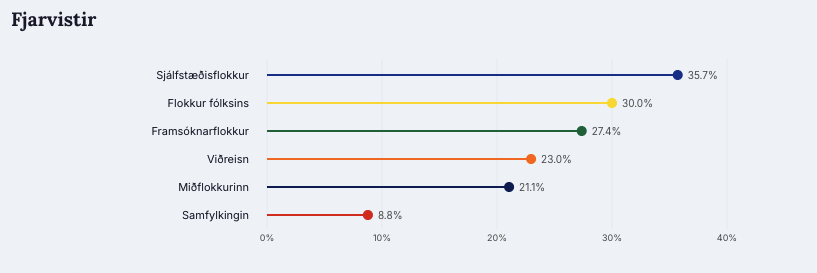{.stack-image .fragment}
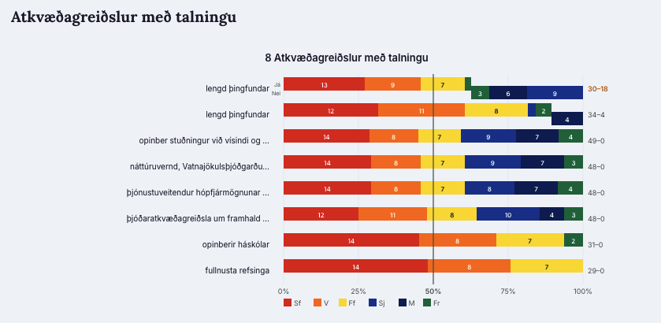{.stack-image .fragment}
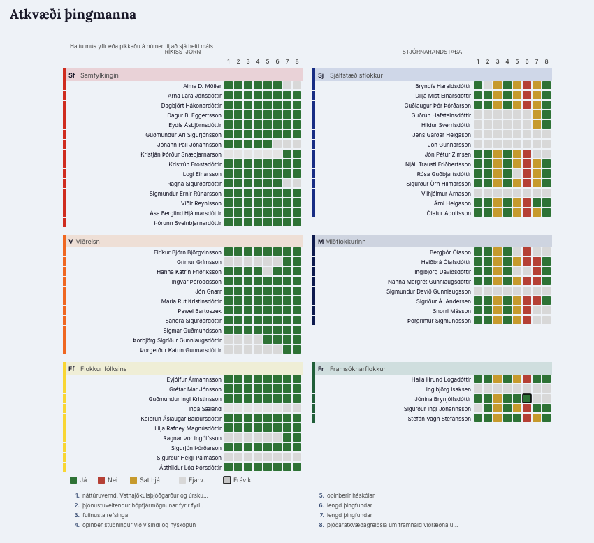{.stack-image .fragment}
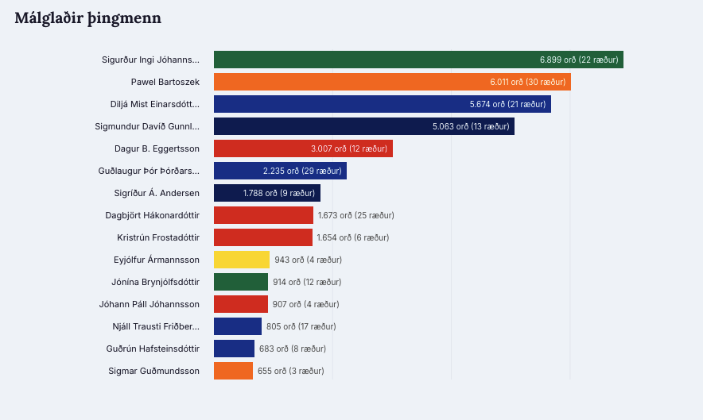{.stack-image .fragment}
:::

## {data-name="ESB-vaktin" .no-heading}

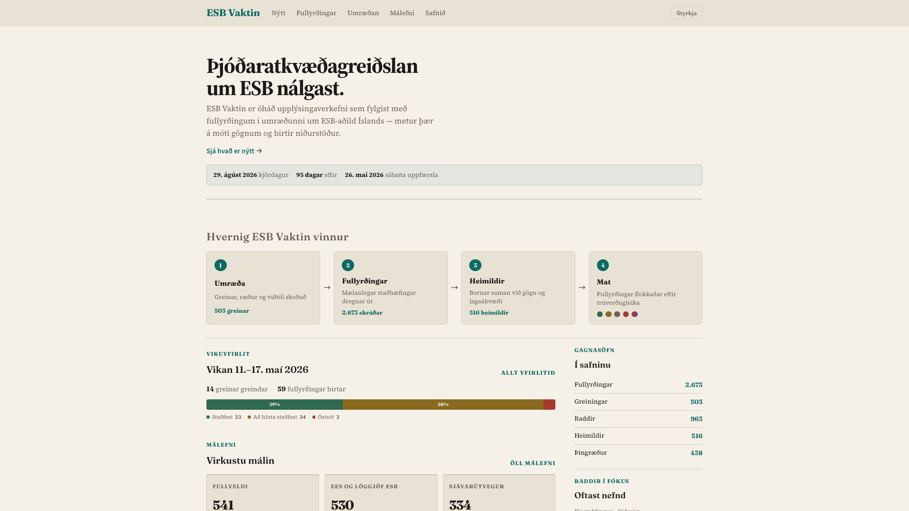{.site-frame fig-align="center" width="72%"}

## {.no-heading}

  1
  Discussion
  Articles, speeches, and interviews scanned
  503 articles

→

  2
  Claims
  Measurable assertions extracted
  2,673 logged

→

  3
  Sources
  Cross-referenced with data and legal codes
  516 sources

→

  4
  Verdict
  Claims classified by quality
  ● ● ● ● ●

Article<em>"The proportion is likely closer to 20% today, but a long way from 75–80%."</em>Stjórnmálin · 24 March→Claim"Iceland has adopted 80% of EU regulation"→EvidenceEEA-LEGAL-001 · EEA-DATA-017 · EEA-LEGAL-006→Partially confirmed

## {.no-heading}

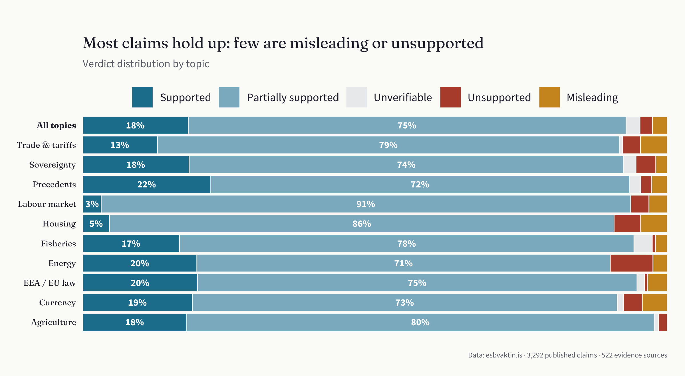{fig-align="center" width="86%"}

## {.no-heading}

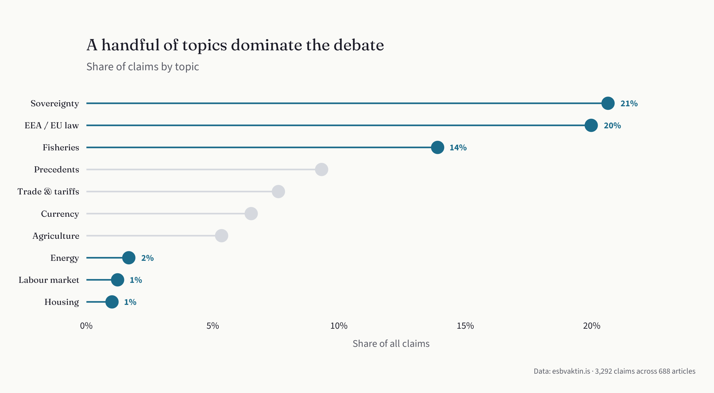{fig-align="center" width="86%"}

## {.no-heading .reframe-slide}

::: {.reframe}

An LLM is a tool.

::: {.fragment}
Verify the methods.
:::

::: {.fragment}
Fail loudly.
:::

:::

## {.no-heading}

::: {.three-tips}

:::: {.tip-row .fragment}
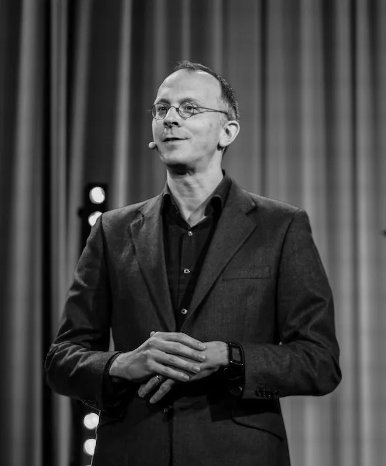{.tip-portrait}

::: {.tip-body}
[*"Does this make me feel emotional?"*]{.tip}

[— Tim Harford]{.attribution}
:::
::::

:::: {.tip-row .fragment}
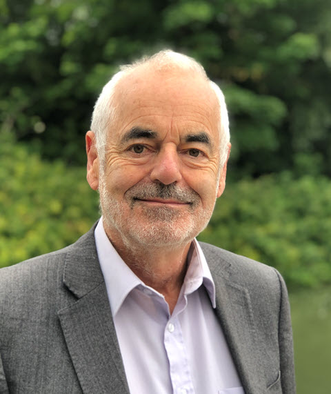{.tip-portrait}

::: {.tip-body}
[*"Is someone trying to inform me, or to persuade me?"*]{.tip}

[— David Spiegelhalter]{.attribution}
:::
::::

:::: {.tip-row .fragment}
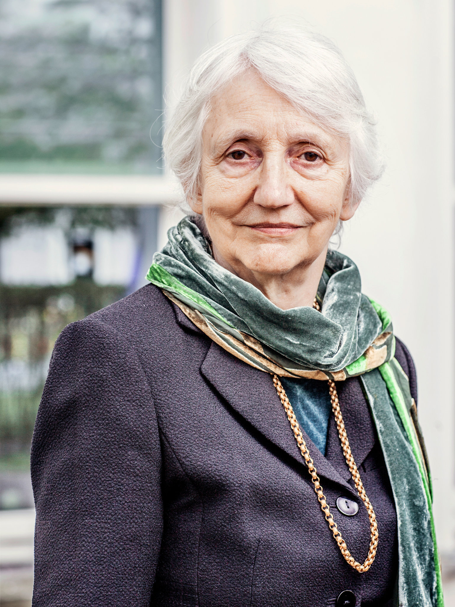{.tip-portrait}

::: {.tip-body}
[*"Don't try to increase trust — demonstrate trustworthiness."*]{.tip}

[— Onora O'Neill]{.attribution}
:::
::::

:::

## Thank you {.thank-you}

- [metill.is](https://metill.is)
- [esbvaktin.is](https://esbvaktin.is)
- [thingfrettir.is](https://thingfrettir.is)
- *Sirkabát* podcast (with Georg Gylfason)
